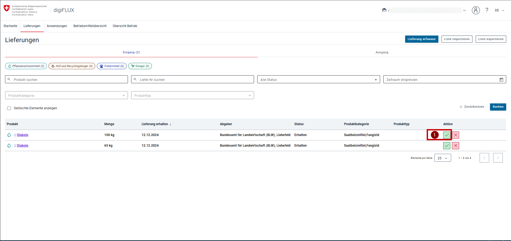
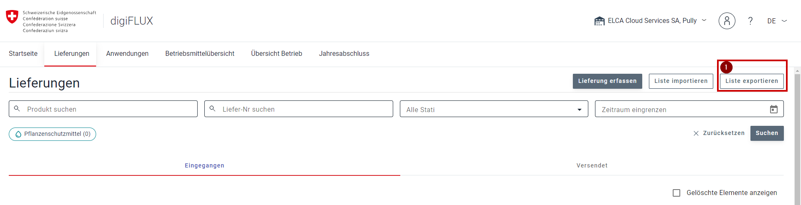
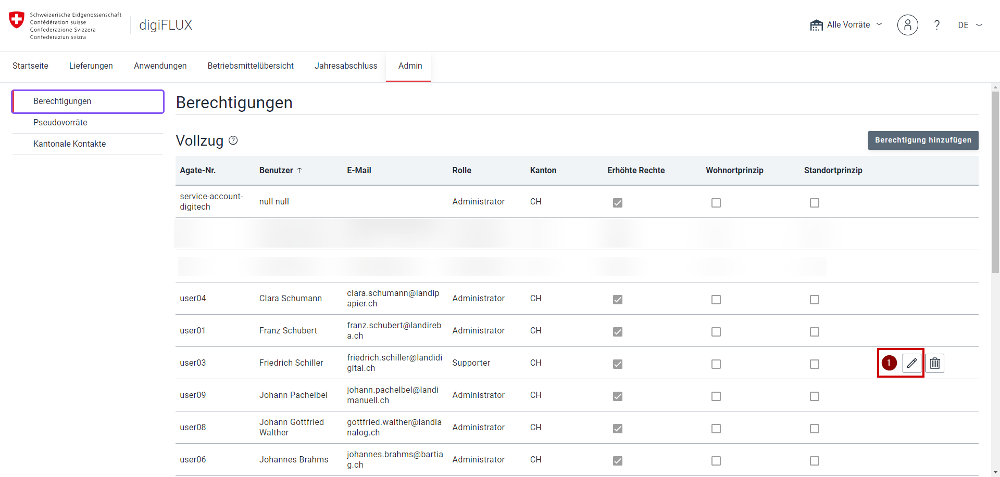

= DigiFLUX-Benutzerhandbuch
:showtitle:
:page-title: DigiFLUX Benutzerhandbuch
:toc:
:toclevels: 3
:toc-title: Inhaltsverzeichnis

== Über digiFLUX

=== Neuigkeiten
Neuigkeiten zu digiFLUX sind jederzeit hier abrufbar: https://digiflux.info/de/

=== Support
Bei technischen Problemen helfen unsere Beraterinnen und Berater Ihnen gerne weiter.
[cols=*2**]
|===
|**Telefon** |+41 58 402 25 50
|**Mail**   |phyto@blw.admin.ch
|===
Für fachliche Fragen kontaktieren Sie das für Sie zuständige Amt.

== Benutzerhandbuch für Meldepflichtige

=== Navigation

==== Allgemeines

In der Kopfzeile der Anwendung stehen die wichtigsten Funktionen jederzeit zur Verfügung.

*(1)* Wenn Sie oben links klicken, kommen Sie zurück zur Startseite, egal wo Sie sich gerade befinden.

*(2)* Falls Sie bereits mit digiFLUX gearbeitet haben, ist das Menü mit dem aktuell ausgewählten Betrieb/Vorrat sichtbar. Hier haben Sie Schnellzugriff auf alle wichtigen Funktionen für Ihren Betrieb.

*(3)* Mit dem Männchen können Sie die Benutzereinstellungen aufrufen und sich ausloggen.

*(4)*, *(5)* Ebenfalls steht ein Hilfemenü und eine Option, um die Sprache zu ändern, zur Verfügung.

*(6)* Die Registerkarten unter der Kopfzeile führen Sie zu den  verschiedenen Bereichen *(Startseite, Lieferungen etc.)* von digiFLUX.

==== Benutzereinstellungen

*(1)* In den Benutzereinstellungen können sich aus digiFLUX ausloggen.

*(2)* Ebenfalls können Sie festlegen wie oft sie über neue/offene Lieferungen benachrichtigt werden, sofort, einmal täglich oder einmal wöchentlich als Zusammenfassung.

==== Hilfe

*(1)* In den Hilfeeinstellungen finden Sie die Kontaktmöglichkeiten für den Support sowie der für Sie zuständigen Ämter, falls Sie Fragen oder Probleme haben.

Ebenfalls können Sie von dort das Handbuch aufrufen.

==== Sprachen

*(1)* In diesem Menü können Sie die Sprache der Anwendungsoberfläche ändern, es stehen Deutsch, Französisch und Italienisch zur Verfügung.

=== Erste Schritte - Vorrat anmelden

Um mit digiFLUX arbeiten zu können, benötigen Sie mindestens einen Vorrat, welcher Ihnen ermöglicht mit Betriebsmitteln z.B. Pflanzenschutzmitteln zu arbeiten.

Ein Vorrat bildet Ihren Betrieb inklusive Lager virtuell ab. Die untenstehenden Schritte geben Ihnen eine Übersicht wie ein Vorrat in digiFLUX angemeldet werden kann.

*(1)* Um einen Vorrat anzumelden, beginnt man mit der Auswahl des betroffenen Standortes für den der Vorrat ertellt  werden soll.

*(2)* Im nächsten Schritt wird ein Aktivierungscode generiert und aus Sicherheitsgründen wird dieser per Post an die Adresse des Betriebes geschickt.

*(3)* Nach Erhalt des Codes gibt man diesen ein und nimmt die Grundeinstellungen des Vorrats vor.

*(4)* Am Ende dieses Prozesses ist der Vorrat in digiFLUX angemeldet und kann verwendet werden.

==== Prozess starten

Wenn Sie sich zum ersten Mal in digiFLUX einloggen, landen Sie auf der Willkommensseite, welche Ihnen einen Überblick über digiFLUX gibt.

*(1)* Klicken Sie auf *Jetzt beginnen* , um Ihren ersten Vorrat zu beantragen.

==== Betrieb suchen

Als Nächstes müssen Sie den Standort, den Sie als Vorrat registrieren möchten suchen, hierfür durchsucht digiFLUX das BUR-Register nach passenden Standorten.

*(1)*, *(2)* Geben Sie  einen oder mehrere der folgenden Werte für die Suche ein:

[cols=*2**]
|===
| **Firmenname**   | Name Ihres Betriebes
| **BUR-Nr.**    | Nummer Ihres Standortes
| **UID**  | Nummer Ihres Unternehmens
| **TVD**  | TVD-Nummer des Betriebes
| **Postleitzahl**  | Postleitzahl des Betriebes
|===

:tip-caption: ℹ️
[TIP]
Die Suche mithilfe des Firmennamens  ermöglicht das Finden von Unternehmenseinträgen aus dem BUR-Register basierend auf Einzelwörtern , wobei Treffer flexibel und unabhängig von Wortposition oder -kontext erfolgen. Dabei werden auch Teilwörter berücksichtigt, sodass Eingaben wie «Meier Söhne» Treffer wie «Meier Söhne AG» oder «Blaumeier Rudi & Söhne» liefern können.

*(3)* Anschliessend starten Sie die Suche mit dem Knopf *Suchen*. Die Liste mit passenden Ergebnissen wird angezeigt.

:tip-caption: ℹ️
[TIP]
Es ist ebenfalls möglich, mehrere Vorräte gleichzeitig zu registrieren indem man mit Firmenname oder UID sucht und anschliessend aus der Ergebnisliste mehrere Standorte auswählt.

==== Standort auswählen

*(1)* Wählen Sie Ihren Standort oder Ihre Standorte aus der Suchresultatsliste aus.

*(2)* Dann klicken Sie am Ende der Liste auf *Vorräte für ausgewählte Standorte*.

*(3)* Bestätigen Sie die erscheinende Meldung mit *OK*.

:tip-caption: ℹ️
[TIP]
Sie können auch abbrechen und Ihre Auswahl ändern.

*(4)* Klicken Sie auf *Zu meinen Vorräten*.

Sie gelangen zur Liste Ihrer Vorräte. Hier können Sie bereits registrierte sowie Vorräte bei denen die Registrierung noch nicht abgeschlossen ist sehen.

==== Anmeldung abschliessen

Nach dem Sie den Aktivierungsbrief erhalten haben, können Sie Anmeldung des Vorrats abschliessen.

*(1)* Navigieren Sie zur Liste der Vorräte auf der *Startseite*.

*(2)* Klicken Sie für den Vorrat, für den Sie die Anmeldung abschliessen wollen auf *Code eingeben*.

Sie gelangen zur Seite *Vorrat-Anmeldung abschliessen*.

*(3)* Geben Sie hier im vorgegebenen Textfeld den Code ein, den Sie per Post erhalten haben.

*(4)* Anschliessend wählen Sie die für Sie zutreffende Rolle aus.

*(5)* Als Nächstes geben Sie den Wohnkanton der verantwortlichen Person ein.

*(6)* Danach legen Sie fest in welcher Einheit Sie Ihre Flächen angezeigt haben wollen.

*(7)* Zuletzt geben Sie an, ob Sie Daten aus Kantonssystemen importieren möchten.

*(8)* Dann bestätigen Sie Ihre Eingaben.

:tip-caption: ℹ️
[TIP]
Sie können auch abbrechen und Ihre Auswahl ändern.

=== Erste Schritte - Vorratsübernahme

In der Landwirtschaft kommt es regelmässig zu Übernahmen von Vorräten, beispielsweise bei der Betriebsübernahme von den Eltern an die nächste Generation.

Diese Übernahmen werden durch das BUR-Register gesteuert und in digiFLUX synchronisiert:

* Vorrats- und Betriebsübernahmen werden vom BUR-Register an digiFLUX gemeldet.
* Das BUR-Register bestimmt, welcher Betrieb der Nachfolger eines bestehenden Betriebs ist.

Wenn das BUR-Register die Übernahme eines in digiFLUX registrierten Betriebs meldet, passiert folgendes:

* Der Vorrat des bestehenden Betriebs wird auf "inaktiv" gesetzt. Dieser Vorrat ist dann nur noch lesend zugänglich, und es können keine neuen Transaktionen (z. B. Lieferungen oder Anwendungen) mehr erfasst werden.

* Ein Informationsbrief wird an die Domiziladresse des Nachfolgebetriebs gesendet. Der Brief enthält einen Freischaltcode sowie zusätzliche Informationen, um die Übernahme des Betriebs in digiFLUX abzuschließen.

Der Nachfolgebetrieb kann bei der Übernahme die folgenden Daten vom Vorgängerbetrieb übernehmen:

* *Benutzerberechtigungen* - Benutzer, die Rechte auf dem Vorrat des Vorgängerbetriebs haben, erhalten dieselben Rechte auf dem Nachfolgerbetrieb, mit Ausnahme der Rolle "Inhaber".

* *Flächen* - Der Nachfolgebetrieb erhält Kopien der digiFLUX-Flächen des Vorgängerbetriebs zum Zeitpunkt der Vorratsübernahme.

* *Produkte* -  Mittels einer Liefertransaktion werden die in digiFLUX enthaltenen Produktbestände vom Vorgängervorrat zum Nachfolgervorrat übertragen. Das Lager des Nachfolgervorrats wird dadurch initialisiert. Es wird empfohlen, anschliessend eine manuelle Lagerkorrektur durchzuführen, um die tatsächlichen Bestände aller Produkte zu erfassen.

Sobald die Übernahme in digiFLUX gemeldet wurde, kann diese über den regulären Anmeldeprozess abgeschlossen werden.

*(1)* Folgen Sie den Schritten des Anmeldeprozesses, bis Sie den Freischaltcode eingeben können. Dieser wird Ihnen als Brief an die Adresse Ihres Betriebs zugeschickt. Klicken Sie auf *Code eingeben*, um den Code einzugeben.

*(2-6)* Geben Sie den Code ein und nehmen Sie die notwendigen Einstellungen für den Vorrat vor.

*(7)* Klicken Sie anschliessend auf *Anmeldung abschliessen*.

*(8), (9)* Im angezeigten Popup wählen Sie aus, welche Daten Sie vom Vorgängerbetrieb übernehmen möchten. Mit den Vorratsberechtigungen übernehmen Sie alle Benutzer des Vorgängerbetriebs (ausser den Inhaber). Zusätzlich können Sie auch die Flächen und Kulturen des Vorgängervorrats übernehmen.

*(10)* Mit *Daten übernehmen* bestätigen Sie Ihre Auswahl und schliessen den Transfer ab.

Die Daten wurden nun erfolgreich auf den Nachfolger-Vorrat übertragen.

:tip-caption: ℹ️
[TIP]
Nach der Übernahme sind nur die Transaktionen sichtbar, die nach dem Transfer erstellt wurden. Um ältere Transaktionen einsehen zu können müssen sie auf dem Vorgängervorrat berechtigt werden.

=== Erste Schritte - Vorrat konfigurieren und aktivieren

===  Startseite

Auf der Startseite haben Sie Zugriff auf alle Hauptfunktionen, um Ihren Vorrat zu verwalten. Um alle Aktionen für einen bestimmten Vorrat ausführen zu können, müssen Sie
<<Vorratsberechtigungen,Inhaber oder stellvertretender Inhaber>> von diesem Vorrat sein.

Folgende Aktionen sind auf der Startseite verfügbar:

* *(1) Den Vorrat zur Liste der Favoriten hinzufügen* - Dies ermöglicht Ihnen den schnellen Zugriff auf diesen Vorrat in der gesamten Anwendung.
* *(2) Die Vorratsberechtigungen aufrufen* - Diese dienen dazu zu verwalten, wer alles Zugriff auf Ihren Vorrat hat.
* *(3) Die Vorratseinstellungen aufrufen* - Hier lassen sich allgemeine Einstellungen für den Vorrat vornehmen.
* *(4) Den Vorrat als aktiven Vorrat auswählen* - Hiermit wählen Sie diesen Vorrat als Arbeitsvorrat aus und können Lieferungen und Anwendungen für diesen Vorrat erstellen sowie Flächen erfassen und Lagerbestände einsehen.

:tip-caption: ℹ️
[TIP]
Die Vorratsberechtigungen und die Vorratseinstellungen stehen nur dem Inhaber und dem stellvertretenden Inhaber zur Verfügung.

*(5)*, *(6)* Welcher Vorrat gerade aktiv ist, ist sichtbar durch die Hervorhebung in der Liste der Vorräte  sowie in der Kopfzeile der Anwendung.

=== Schnellzugriff

Einige der auf der Startseite verfügbaren Aktionen sind ebenfalls in der gesamten Anwendung über das Menü in der Kopfzeile verfügbar:

* *(1) Die Vorratseinstellungen* aufrufen.
* *(2) Die Vorratsberechtigungen* aufrufen.

Ebenfalls verfügbar sind:

* *(3) Die Liste der Vorräte anzeigen* (Startseite).
* *(4) Liste der Favoriten* -  Alle Vorräte, die auf der Startseite als Favoriten markiert wurden, werden hier aufgelistet und können hier ausgewählt werden.

[[permissions]]
=== Vorratsberechtigungen

Die Vorratsberechtigungen legen fest, wer alles Zugriff auf einen Vorrat hat.

*(1)* Sie können über die Startseite aufgerufen werden.

*(2)* Ebenfalls können die Vorratsberechtigungen über das Menü in der Kopfzeile aufgerufen werden.

==== Übersicht der Berechtigungen

Auf der Seite der Vorratsberechtigungen sehen Sie eine Übersicht über die bereits vergebenen Berechtigungen und können neue erfassen.

*(1)* In der Tabelle *Mein Team* sehen Sie alle Benutzer, die aktuell Zugriff auf Ihren Vorrat haben und mit diesem arbeiten können.

*(2)* In der Tabelle *Vollzug* sind alle Benutzer gelistet, welche Daten einsehen müssen, um die Erfüllung der Meldepflicht zu kontrollieren. Auch der Support mit seinen Berechtigungseinstellungen ist hier ersichtlich.

==== Benutzer auf dem Vorrat berechtigen

:tip-caption: ℹ️
[TIP]
Nur Benutzer, die ein Agate-Konto haben und deren Agate-Nummer Ihnen bekannt ist, können hinzugefügt werden. Falls die gewünschte Person noch nicht über ein Agate-Konto verfügt, kann dieses hier beantragt werden: https://agate.ch/portal/?login

*(1)* Sie können mehreren Personen Zugriff auf Ihren Vorrat mit geben. Personen, die als Benutzer für Ihren Vorrat arbeiten sollen, müssen sich zunächst als Benutzer in Agate.ch registrieren und dort Zugriff auf digiFLUX beantragen. Dann können Sie den Benutzer für Ihren Vorrat berechtigen. Klicken Sie dazu auf *Person hinzufügen*.

Nun können Sie mithilfe der Agate-Nummer den Benutzer auswählen, den Sie Ihrem Vorrat hinzufügen möchten.

*(2)* Geben Sie hierfür die Agate-Nummer des Benutzers im Textfeld ein.

Wird der Benutzer gefunden, wird dessen Vor- und Nachname unter dem Textfeld angezeigt.

*(3)* Nachdem Sie den Benutzer ausgewählt haben, können Sie das Berechtigungsprofil auswählen, das Sie vergeben möchten.

Folgende Berechtigungsprofile sind verfügbar:

[cols=*1,3*]
|===
| Berechtigungsprofil | Beschreibung

| *Inhaber*
| «Inhaber» sind Personen, die den Vorrat erstellt haben und für sämtliche Lieferungen und Anwendungen im Vorrat verantwortlich sind. Diese Personen können erfassen, bearbeiten sowie Berechtigungen erteilen. Diese Berechtigung kann nicht entzogen werden.

| *Stv. Inhaber*
| «Stv. Inhaber» sind Personen, die dieselben Berechtigungen wie der Inhaber haben, aber nicht für den Vorrat verantwortlich sind.

| *Produkte verwalten und anwenden*
| “Produkte verwalten und anwenden” ist für Personen gedacht, die Lieferungen und Anwendungen erfassen und bearbeiten.

| *Produkte anwenden*
| “Produkte anwenden” ist für Personen gedacht, die Anwendungen von Produkten erfassen und bearbeiten.

| *Produkte verwalten*
| “Produkte verwalten” ist für Personen gedacht, die Lieferungen von Produkten erfassen, bearbeiten, akzeptieren oder ablehnen.

| *Lesen*
| “Lesen” ist für Personen gedacht, die alle Lieferungen, Anwendungen und Übersichten im Vorrat lesen können.

| *Kein Zugriff*
| “Kein Zugriff” ist für Personen gedacht, die temporär keinen Zugang mehr zum Vorrat haben sollen.
|===

*(4)* Haben Sie das passende Berechtigungsprofil ausgewählt, können Sie den Benutzer mit *Hinzufügen* zu Ihrem Vorrat hinzufügen.

Der neue Benutzer wird dann in der Tabelle *Team* angezeigt.

==== Berechtigungen ändern

*(1)* Wenn Sie die Berechtigungen für einen bereits hinzugefügten Benutzer anpassen möchten, klicken Sie auf den Stift neben dem entsprechenden Benutzer in der *Mein Team*-Tabelle auf der Seite der Vorratsberechtigungen .

*(2)* Ändern Sie das Berechtigungsprofil anschliessend .

*(3)* Klicken Sie dann auf *Fertig* , um die Änderungen zu übernehmen.

===== Support

*(1)* Sie können ebenfalls die Berechtigungen des Supports ändern. Klicken Sie hierfür in der Tabelle *Vollzug* auf den Stift in der Zeile *Supporter*.

*(2)* Anschliessend können Sie das Berechtigungsprofil für den Support ändern

Folgende Profile sind für den Support verfügbar:

[cols=*1,3*]
|===
| Berechtigungsprofil | Beschreibung

| *Nur Lesen*
| Diese Berechtigung ermöglicht es, alle Lieferungen, Anwendungen und Übersichten im Vorrat zu lesen.

| *Bearbeiten*
| Diese Berechtigung ermöglicht es, Lieferungen und Anwendungen im Vorrat zu erfassen und zu bearbeiten.

| *Kein Zugriff*
| Diese Berechtigung ermöglicht es, temporär die Berechtigungen zu entziehen.
|===

*(3)* Klicken Sie dann auf *Fertig* um Ihre Auswahl zu bestätigen.

==== Benutzer vom Vorrat löschen

*(1)* Wenn Sie die Berechtigungen für einen bereits hinzugefügten Benutzer anpassen möchten, klicken Sie auf den Abfalleimer neben dem entsprechenden Benutzer in der *Mein Team*-Tabelle auf der Seite der Vorratsberechtigungen.

*(2)* Anschliessend bestätigen Sie dies mit *Entfernen*.

Der Benutzer wird nun nicht mehr in der *Mein Team*-Tabelle angezeigt.

=== Vorratseinstellungen

image::images_settings/settings_dropdown.png[Alt-Text, width=1300, height=1100]

Die Vorratseinstellungen können ebenfalls von verschiedenen Stellen aus aufgerufen werden.

*(1)* Auf der Homepage.

*(2)* Im Menü in der Kopfzeile.

==== Vorratseinstellungen anpasssen

Beim Anmelden Ihres Vorrates legen Sie bereits die Einstellungen fest, diese können Sie jederzeit anpassen.

*(1)* In den Vorratseinstellungen können Sie die bei der Vorratsregistrierung festgelegte organisatorische Rolle nachträglich anpassen.

*(2)* Ebenfalls können Sie den Kanton der verantwortlichen Person hier ändern.

*(3)* Des Weiteren können Sie das bevorzugte Flächenmass hier anpassen .

*(4)* Ausserdem lassen sich die Importeinstellungen für die Daten aus dem kantonalen Agrarinformationssystem anpassen.

*(5)* Pro Vorrat und Produktfamilie können Einstellungen vorgenommen werden, in welchem Rhythmus Lieferungen akzeptiert werden:

[cols=*1,3*]
|===
| Einstellung | Beschreibung

| **Automatisch akzeptieren**
| Lieferungen an diesen Vorrat werden automatisch akzeptiert.

| *Automatisch nach 15 Tagen akzeptieren*
| Lieferungen an diesen Vorrat werden nach 15 Tagen automatisch akzeptiert.

| *Manuell akzeptieren*
| Lieferungen an diesen Vorrat müssen manuell durch einen berechtigten Benutzer akzeptiert werden.
|===

Wenn Sie alle Einstellungen Ihren Vorstellungen entsprechend vorgenommen haben, können Sie dies mit *Speichern* übernehmen.

=== Mitteilungsflicht - Lieferungen

Ab dem 1. Januar 2026 müssen Verkäufe und Weitergaben von Pflanzenschutzmitteln, Düngern und Kraftfutter digital beim Bundesamt für Landwirtschaft *(BLW) über die Webanwendung digiFLUX gemeldet werden.

Die Mitteilungspflicht gilt für:

* Agrar- und Gartenhandel

* Vergärungs- und Kompostierungsanlagen
* Landwirte, die Produkte weitergeben

Bei jeder Lieferung müssen folgende Angaben erfasst werden:

* Produktart

* Liefermenge

* Lieferdatum

* Abnehmer

* Abgeber

Unternehmen können die Meldungen wahlweise:

* Manuell in der Webanwendung eingeben

* Per Datei-Upload übermitteln

* Automatisch über eine Programmierschnittstelle (API) übertragen

Wichtige Ausnahmen:

* Der reine Zwischenhandel ist von der Meldepflicht ausgenommen

* Lieferungen an Händler, die Produkte nur weiterverkaufen, müssen nicht gemeldet werden

Ziel der Regelung ist eine transparente, lückenlose digitale Dokumentation von Agrarprodukten, die den Überblick über Verkauf und Verwendung verbessern soll.

In digiFLUX besteht der Lieferprozess aus  vier Schritten:

* *Empfänger* - Empfänger der Lieferung auswählen

* *Produkt* - Auswahl des Produkts  sowie Eingabe der Liefermenge

* *Lieferung* - Zusätzliche Lieferdaten wie Kommentar und Liefernummer eingeben

* *Zusammenfassung* - Übersicht der getägtigen Eingaben und letzer Schritt bevor die Lieferung gespeichert werden kann.

Der Absender ist in der Regel der eigene aktive Vorrat, während der Empfänger oft ein anderer Unternehmensvorrat ist.

In speziellen Fällen, wie bei Importen oder Exporten, können Pseudovorräte für Absender und Empfänger verwendet werden.

Es ist auch möglich, Lieferungen an Personen zu adressieren oder Lieferungen von einem fremden Vorrat an sich selbst zu melden, wenn der eigene Vorrat zu einer Vergärungs- oder Kompostieranlage gehört.

Weitere Details zu diesen Fällen werden weiter unten erklärt.

==== Lieferübersicht

Die Lieferübersicht kann über den Tab *Lieferungen* aufgerufen werden und dient als Ausgangspunkt für alle Aktionen, die mit Lieferungen in Verbindung stehen.

In der Kopfzeile der Lieferübersicht stehen Ihnen folgende Aktionen zur Verfügung:

* *(1) Lieferung erfassen* - Eine neue Lieferung erfassen
* *(2) Liste importieren* - Lieferungen aus einer Excel-Datei importieren
* *(3) Liste exportieren* - Lieferungen als Excel exportieren

Auf der Lieferübersicht gibt es zwei Hauptansichten mit welchen Sie Ihre Lieferungen betrachten können:

*(4)* Mit einem KLick auf die  Registerkarte *Eingang* zeigen Sie alle empfangenen/eingegangenen Lieferungen an.

*(5)* Ebenfalls können Sie mit der Registerkarte *Ausgang* die ausgehenden/versendeten Lieferungen anzeigen.

Für die Suche nach bestimmten Lieferungen sowie der weiteren Eingrenzung der angezeigten Lieferungen stehen  folgende  Filter zur Verfügung:

* *(6) Produktfamilie* - Auswahl der Produktfamilien, für die die Lieferungen angezeigt werden können

* *(7) Produkt suchen* - Suche nach Produktnamen

* *(8)Liefer-Nr. suchen* - Suche nach der in digiFLUX erstellten Liefer-Nr.

* *(9) Alle Status* - Suchen nach Lieferstatus

* *(10) Zeitraum eingrenzen* - Zeitraum festlegen, für den die Lieferungen angezeigt werden sollen

* *(11) Produktkategorie* - Suche nach Produktkategorie

* *(12) Produkttyp* - Suche nach Produkttyp

* *(13) Gelöschte Elemente anzeigen* - Ermöglicht es gelöschte Elemente anzuzeigen

* *(14) Zurücksetzen und Suchen* - Zurücksetzen setzt alle Eingaben zurück, Suchen startet die Suche

*(15)* Die Lieferungen werden unten in der Tabelle basierend auf Ihren Eingaben gefiltert angezeigt.

==== Lieferung erstellen

*(1)* Mit dem Knopf *Lieferung erfassen*  gelangen Sie zum ersten Schritt des Lieferprozesses.

:tip-caption: ℹ️
[TIP]
Nach der ersten Frist des Jahresabschlusses (üblicherweise dem 31. Januar), können Sie keine neuen Lieferungen für das Vorjahr erstellen.

===== Schritt 1: Absender  und Empfänger  auswählen

In diesem Schritt werden der Absender und Empfänger der Lieferung, sowie das Lieferdatum erfasst.

Eine Lieferung erfolgt in der Regel zwischen zwei Vorräten, wobei der Absender meist der eigene aktive Vorrat und der Empfänger ein anderer Unternehmensvorrat ist.

Für besondere Liefersituationen, wie Importe, Exporte oder Lieferungen an Privatanwender, können  sogenannte Pseudovorräte verwendet werden.

Auch Lieferungen an  Personen  sind in Ausnahmesituationen möglich, wen kein Betrieb als Ziel der Lieferung ermittelt werden kann.

Bei Vorräten mit der Rolle Vergärungs- oder Kompostieranlage, können Lieferungen von fremden Vorräten an den eigenen Vorrat gemeldet werden.

====== Lieferung vom eigenen aktiven Vorrat an einen anderen Unternehmensvorrat

*(1)* Um eine Lieferung an einen anderen digiFLUX-Unternehmensvorrat zu erstellen, klicken Sie auf den Knopf *Betrieb*.

Anschliessend werden die Filter zur Suche nach Unternehmen angezeigt:

* *(2) Vorratsname* - Ermöglicht die Suche nach dem Unternehmensnamen .
* *(3) PLZ oder Ort* - Ermöglicht die Suche nach der Postleitzahl oder dem Ortsnamen
* *(4) BUR-Nr* - Ermöglicht es nach der BUR-Nummer zu suchen.

*(5)* Sie können die Suche zurücksetzen, falls Sie neue Eingaben tätigen möchten.

*(6)* Möchten Sie die Suche starten, klicken Sie auf *Suchen*.

*(7)* Die Suchresultate werden angezeigt, wählen Sie das passende Suchresultat aus.

*(8)* Wenn Sie vorhaben diesen Betrieb später für weitere Lieferungen zu verwenden können Sie diesen mit einem Klick auf den Stern zu den Favoriten hinzufügen.

*(9)* Klicken Sie danach auf *Weiter*.

====== Lieferung vom eigenen aktiven Vorrat an eine Person

Sie können ebenfalls Lieferungen an Personen, die bereits in digiFLUX registriert sind oder auch an Personen ohne digiFLUX-Zugang senden.

DigiFLUX verwendet hierfür sogenannte Personenvorräte, um Lieferungen Personen zuzuordnen.

:tip-caption: ℹ️
[TIP]
Verwenden Sie Personenvorräte nur in Ausnahmefällen, wenn kein passender Unternehmensvorrat gefunden wurde. In der Regel sollten in digiFLUX immer mit Unternehmensvorräten oder Pseudovorräten arbeiten. Personenvorräte sind auf ein paar wenige Aktionen begrenzt, welche es Ihnen nur ermöglichen Lieferungen zu erhalten und diese weiter zu liefern. Es ist ratsam Lieferungen an einen Personenvorrat schnellstmöglich an einen Unternehmens weiterzuliefern damit die Produkte im Lager verwaltet werden können.

*(1)* Um an Personen zu liefern, klicken Sie auf *Personen*.

*(2)* Hat die Person, die die Lieferung empfangen soll, bereits ein Agate-Konto und Sie kennen deren Agate-Nummer, können Sie diese direkt eingeben.

*(3)* Wird das Konto gefunden, wird der Vor- und Nachname der Person angezeigt.

Falls Ihnen das Agate-Konto nicht bekannt ist, können Sie die Adressdaten der Person eingeben.

*(1)*, *(2)* Geben Sie den Vornamen  und den Nachnamen  der Person ein.

*(3)*, *(4)*, *(5)*  Anschliessend geben Sie die Postleitzahl und den Ort  sowie den Kanton ein.

*(6)* Als Nächstes geben Sie die E-Mail-Adresse ein.

*(7)* Geben Sie danach das Geburtsdatum ein.

*(8)* Zuletzt geben Sie die Telefonnummer ein.

====== Vergärungs- und Kompostieranlage - Lieferung von einem fremdem Vorrat an meinen Vorrat

In digiFlux gibt es einen Sonderfall, welcher die Erfassung von Lieferungen an Unternehmensvorräte betrifft.

Hat der aktive Vorrat die Rolle *Vergärungs- und Kompostieranlage*, kann beim Erfassen von Lieferungen ein beliebiger Vorrat als Absender gewählt werden.

So können Mitarbeitende einer Vergärungs- und Kompostieranlage eingehende Lieferungen  selbst an Ihren Betrieb melden ohne, dass der Absender diese erfassen muss.

*(1)* Damit Sie einen beliebigen digiFLUX Unternehmensvorrat als Absender auswählen können, muss ein Vorrat mit der Rolle *Vergärungs- und Kompostieranlage* aktiv sein.

*(2)* Klicken Sie auf *Betrieb* um die Suchfelder anzuzeigen

*(3)* Suchen Sie nach dem Betrieb, welcher Ihnen die Lieferung zugestellt hat.

*(4)* Wählen Sie den entsprechenden Betrieb aus.

*(5)* Bestätigen Sie und gehen Sie zum nächsten Schritt

====== Pseudovorrat - Speziallieferung vom eigenen aktiven Vorrat

Für Spezialfälle werden in digiFLUX Pseudovorräte verwendet, hierbei kann  es sich   Ereignisse wie Verlust oder Entsorgung handeln bei denen keine Produkte von an eine Person oder Betrieb fliessen.

Weitere Spezialfälle sind Lieferungen von oder  an Firmen und Personen im Ausland, welche selbst keine Produkte in digiFlUX melden müssen und daher über keine eigen  Vorräte verfügen.

Standardmässig sind folgende Spezialfälle zur Erfassung von Lieferungen in digiFLUX verfügbar:

[cols=*4**]
|===
| Name              | Beschreibung           | Richtung   | Mit Adresse
| *Privatanwender*   | Privatpersonen         | Ausgehend  | Ja
| *Entsorgung*        | Entsorgung von Mitteln | Ausgehend  | Nein
| *Verlust*           | Verlust von Mitteln    | Ausgehend  | Nein
| *Ausland (Ausfuhr)* | Export von Mitteln     | Ausgehend  | Ja
| *Ausland (Einfuhr)* | Import von Mitteln     | Eingehend  | Ja
| *Sonstige*          | Weitere Ereignisse     | Beide      | Nein
|===

Diese können je nach Fall für zu ausgehende oder zu eingehende Lieferungen oder für beides verwendet werden.

*(1)* Um Lieferungen an Pseudovorräte zu erstellen, klicken Sie auf *Andere*.

Anschliessend wählen Sie den gewünschten Fall aus der Liste aus (nur Fälle, die ausgehende Lieferungen zulassen, werden angezeigt) .

*(2)* Bei einigen Fällen sind Adress- und Kontaktdaten Pflicht, wie auf dem Bild für den Fall *Ausland (Ausfuhr)* gezeigt.

*(3-10)* Füllen Sie für diese Fälle die entsprechenden Felder aus.

:tip-caption: ℹ️
[TIP]
Der Absender ist automatisch Ihr aktuell ausgewählter Vorrat.

====== Pseudovorrat - Speziallieferung an eigenen aktiven Vorrat

Die oben genannten Spezialfälle können teilweise auch als Absender verwendet werden.

*(1)* Hierfür klicken Sie im Abschnitt Abgeber auf *Andere*.

*(2)* Anschliessend wählen Sie den gewünschten Fall aus der Liste aus (nur Fälle, die eingehende Lieferungen zulassen, werden angezeigt) .

*(3-10)* Bei Fällen, die Adress- und Kontaktdaten erfordern, füllen Sie die entsprechenden Felder aus.

*(11)* Mit *Weiter* gelangen Sie zum nächsten Schritt.

:tip-caption: ℹ️
[TIP]
Der Empfänger ist automatisch Ihr aktuell ausgewählter Vorrat.

===== Schritt 2: Produkt auswählen

Nachdem dem Festlegen von Absender und Empfänger der Lieferung, bestimmen Sie in diesem Schritt das gelieferte Produkt und dessen Menge.

Um das Produkt zu finden, welches Sie liefern möchten, stehen folgende Filter zur Verfügung:

* *(1) Produktfamilie* - Ermöglicht die Auswahl der Produktfamilie, um nur entsprechende Produkte angezeigt zu bekommen.

*(2)* Für jede Produktfamilie ist eine Gruppe von Filtern vorhanden:

* *Pflanzenschutzmittel*
** Produktbezeichnung - Suche mit Produktnamen
** Inhaltstoff - Suche nach Inhaltsstoff
** Zulassungsnummer - Suche nach Zulassungsummer
** Bewilligungsinhaber - Suche nach Namen des Bewilligungsinhaber
* *Hof- und Recyclingdünger (HofRec)*
** Produktbezeichnung - Suche mit Produktnamen
** Produktkategorie - Suche nach Produktkategorie
** Produkttyp - Suche nach Produkttyp
* *Futtermittel*
** Produktbezeichnung - Suche mit Produktnamen
** Hersteller - Suche nach Hersteller Namen
** Produktkategorie - Suche nach Produktkategorie
** Produkttyp - Suche nach Produkttyp
* *Dünger*
** Produktbezeichnung - Suche mit Produktnamen
** Hersteller - Suche nach Hersteller Namen
** Produktkategorie - Suche nach Produktkategorie
** Produkttyp - Suche nach Produkttyp

Pro Produktfamilie können verschiedene Filter miteinander kombiniert werden.

Möchten Sie alle Ihre Eingaben zurücksetzen, können Sie den Knopf *Zurücksetzen* verwenden.

Klicken Sie auf *Suchen*, um die Suche zu starten.

Anschliessend werden die Suchresultate angezeigt.

*(3)* Klicken Sie auf das passende Produkt.

*(4)* Geben Sie die gewünschte Menge ein, die Einheit ist bereits vorgegeben.

*(5)* Klicken Sie auf *Weiter*, um zum nächsten Schritt zu gelangen.

:tip-caption: ℹ️
[TIP]
Lieferungen können mit negativer Menge erstellt werden, um Fehler zu korrigieren. Eine negative Menge bedeutet, dass das Produkt vom Empfänger zurück zum Absender geschickt wird oder aus dem Vorrat des Empfängers entfernt wird. Alternativ können auch Retouren mit einer Referenz auf die betroffene Lieferung erstellt werden. Wichtig: Der Empfänger muss die Lieferung bestätigen oder ablehnen.

====== Neue Produktvariante erstellen

Für die Produktfamilien «Futtermittel» und «Hof- und Recyclingdünger» (HofRec) können Sie neue Produktvarianten erstellen falls ein gewünschtes Produkt nicht vorhanden ist. Der Ausgangspunkt für eine Variante ist immer ein bestehendes Produkt, dieses können Sie als Variante im vorgegebenen Rahmen an Ihre Bedürfnisse anpassen

*(1)* Wählen Sie  die passende Produktfamilie aus um das gesuchte Standardprodukt zu finden.

*(2)* Suchen Sie nach dem Produkt beispielsweise mit der  *Produktbezeichnung*.

*(3)* Bestätigen Sie die Eingaben mit *Suchen*, um die verfügbaren Produkte zu laden.

*(4)* Wählen Sie das gewünschte Produkt aus.

*(5)* Geben Sie im Feld *Liefermenge* die gewünschte Menge ein, dies können Sie alternativ auch nach Schritt (6) machen.

*(6)* Klicken Sie auf *Produktvariante erstellen*.

Nun öffnet sich ein Popup. Gehen Sie hier wie folgt vor:

*(7)* Geben Sie im Feld *Namenszusatz* einen eindeutigen Zusatz ein, um die neue Produktvariante zu benennen.

*(8)* Tragen Sie das Gültigkeitsdatum der Variante ein oder wählen Sie es über das Kalender-Icon aus.

*(9)* Erfassen Sie die Inhaltsstoffe und deren Konzentration. Die möglichen / benötigten Angaben zu den Inhaltsstoffen sind vom Standardprodukt vorgegeben, ebenso wie die möglichen Wertebereiche für die Konzentrationen. Einige Inhaltsstoffe und deren Konzentration können bei der Erstellung von Varianten nicht angepasst werden.

*(10)* Klicken Sie auf *Weiter* um zurück zum Lieferprozess zu gelangen.

*(11)* Die neue Produktvariante kann nun für die Lieferung verwendet werden. Sie wird erst definitiv gespeichert, wenn Sie die Lieferung abschliessen.

*(12)* Mit *Weiter* können Sie im Lieferprozess fortfahren.

Für HofRec sind bei der Bearbeitung der Inhaltsstoffe ein Analyse Datum sowie eine Datei mit Analyseergebnissen Pflicht.

:tip-caption: ℹ️
[TIP]
====
Die neue erstellte Variante ist erst nach dem Abschliessen der Lieferung für weitere Lieferungen  verfügbar.

*(1)* Möchten Sie eine Übersicht, welche Produktvarianten für Ihren Betrieb erstellt worden sind dann navigieren Sie zur Registerkarte *Übersicht Betrieb*.

*(2)*, *(3)*   Unter *Betriebsspezifische Produkte*  werden alle Produktvarianten aufgelistet.
====

===== Schritt 3: Informationen zur Lieferung erfassen

In diesem Schritt erfassen Sie die Lieferinformationen.

*(1)* Falls Sie die Liefernummer aus Ihrem System auch in digiFLUX erfassen wollen, können Sie dies im entsprechenden Feld machen.

*(2)* Ausserdem können Sie einen Kommentar zur Lieferung schreiben.

*(3)* Mit *Weiter* gelangen Sie zum nächsten Schritt.

===== Schritt 4: Zusammenfassung und Abschluss der Lieferung

In der Zusammenfassung sehen Sie alle Ihre getätigten Eingaben für die Lieferung.

*(1)* Falls Sie Ihre Eingaben ändern möchten, klicken Sie auf *Zurück*, um zum vorherigen Schritt zu gelangen. Wiederholen Sie dies, bis Sie bei den Schritten sind, die Sie anpassen möchten.

*(2)* Möchten Sie die Lieferung abschliessen, klicken Sie auf *Abschliessen*. Die Lieferung wird nun gespeichert.

Nun wurde die Lieferung erfolgreich erstellt.

==== Status einer Lieferung

Wichtig zu wissen ist, dass eine Lieferung nach dem Erstellen verschiedene Status durchläuft bevor Sie auf der Lieferübersicht des Empfängers angezeigt wird.

Für die Sichtbarkeit relevante Status:

* *Erfasst* - Initialer Status: Die Lieferung ist noch nicht für den Empfänger sichtbar und kann noch gelöscht werden
* *Versendet/Erhalten* - Status nach 30 Minuten: Die Lieferung ist für den Empfänger sichtbar, dieser kann sie dann akzeptieren  oder ablehnen.

Zusätzliche Status:

* *Akzeptiert* - Lieferung ist korrekt: Wird vom Empfänger manuell oder automatisch vom System gesetzt.
* *Abgelehnt* - Lieferung ist fehlerhaft: Der Empfänger  hat die Lieferung manuell abgelehnt

Des Weiteren existiert noch der Status *gelöscht*. Lieferungen mit dem Status *erfasst* oder *abgelehnt* können vom Absender gelöscht  werden.

==== Erstellte Lieferung in der Liste anzeigen (ohne Lieferungen an Personen)

*(1)* Nach dem Abschliessen der Lieferung sieht der Absender nun die Lieferung  auf der Lieferübersicht in der Registerkarte *Ausgang*(2).

Die Lieferung hat den Status *erfasst*, was dem Absender ermöglicht diese zu löschen bevor der Empfänger diese akzeptiert.

==== Erstellte Lieferung an eine Person in der Liste anzeigen

image::images_delivery/person_inventory.png[Alt-Text, width=1300, height=1100]

Der Prozess, wie Lieferungen an Personen eingesehen werden können, unterscheidet sich ein wenig von dem oben beschriebenen.

Beim Absender wird die Lieferung genauso wie oben beschrieben angezeigt.

Konnte die Lieferung einem bereits existierenden persönlichen Vorrat zugeordnet werden, erscheint diese direkt im entsprechenden Vorrat.

*(1)*, *(2)*  Hierfür muss auf der Startseite ein Vorrat, der als *Personenvorrat*  betitelt und mit *Persönlich* hervorgehoben ist, existieren.

Ist dies der Fall, kann der Empfänger diesen auf der Startseite auswählen und dann die Lieferübersicht öffnen, wo die Lieferung sichtbar sein sollte.

===== Sonderfall kein passender Personenvorrat wurde gefunden.

Es kann vorkommen, dass die der Empfänger einer Lieferung keinen Personenvorrat in digiFlUX hat oder die Lieferangaben nicht ausreichen um einen existierenden Personenvorrat eindeutig zu identifizieren.
In diesem Fall wird eine E-Mail an den Empfänger der Lieferung geschickt.

*(1)* Diese enthält einen Code, der zum Annehmen der Lieferung benötigt wird.

*(2)* Auf der Startseite in digiFlUX  klicken Sie als Empfänger der Lieferung auf *Lieferung abholen* .

*(3)* Geben Sie  anschliessend im angezeigten Popup den Code aus der E-Mail ein.

*(4)* Mit *Lieferung abholen* bestätigen Sie Ihre Eingaben und holen die Lieferung ab:

* Wenn Sie bereits einen  Personenvorrat haben, wird die abgeholte Lieferung diesem zugeordnet.
* Wenn kein Personenvorrat existiert, wird dieser erstellt und diesem die Lieferung zugeordnet.

Wie weiter oben beschrieben, kann die Lieferung dann auf diesem Personenvorrat  eingesehen werden.

==== Lieferdetails

Zu allen Lieferungen können auf der Lieferübersicht Details eingesehen werden.

*(1)* Klicken Sie hierfür auf die Zeile der Lieferung, die sie öffnen möchten.

*(2)* Es öffnet sich die Detailansicht.

==== Lieferungen ablehnen und akzeptieren

:tip-caption: ℹ️
[TIP]
Nach der zweiten Frist des Jahresabschlusses (üblicherweise dem 15. Februar), können Sie keine Änderungen mehr an Lieferungen  für das Vorjahr vornehmen (ablehnen und akzeptieren)

===== Akzeptieren

image::images_delivery/delivery_accept2.png[Alt-Text, width=1300, height=1100]

Offene Lieferungen sind in der Lieferübersicht im Eingang  mit dem Status *Erfasst* ersichtlich.

*(1)* Möchten Sie eine Lieferung akzeptieren, dann klicken Sie auf das grüne Häckchen bei der entsprechenden Lieferung.

*(2)* Bestätigen Sie Ihre Aktion im angezeigten Popup.

*(3)* Die Lieferung ist nun akzeptiert, dies ist am geänderten Status zu *akzeptiert* ersichtlich.

===== Ablehnen

Falls Sie als Empfänger der Lieferung nicht mit dieser einverstanden ist, kann er diese ablehnen.

*(1)* Hierfür klicken Sie auf das rote Kreuz zum ablehnen

*(2)* Es  öffnet sich ein Popup wo Sie optional den Ablehnungsgrund eingeben können, dieser ist dann für den Sender der Lieferung ersichtlich. Mit *Ablehnen* lehnen Sie die Lieferung definitiv ab.

*(3)* Abgelehnte Lieferungen sind auf der Lieferübersicht mit dem Status abgelehnt ersichtlicht.

:tip-caption: ℹ️
[TIP]
====

Offene Lieferungen können ebenfalls in den Lieferdetails akzeptiert (1) und abgelehnt (2) werden.
====

==== Lieferungen löschen

Lieferungen mit folgendem Status können gelöscht werden:

* *Status Erfasst* - Die Lieferung kann vom Absender gelöscht werden bevor diese für den Empfänger sichtbar wird.
* *Status abgelehnt* - Die Lieferung kann vom Absender gelöscht werden nachdem der Empfänger diese abgelehnt hat.

*(1)* Ist ein Abfalleimer in der Zeile der Lieferung sichtbar, können Sie diese mit einem Klick darauf löschen.

*(2)* Ein Popup öffnet sich, bestätigen sie dort die Löschung.

Während 30 Minuten kann die Löschung von Lieferungen mit dem Status abgelehnt rückgängig gemacht werden.

*(3)* Blenden Sie hierfür die gelöschten Lieferungen mit dem Häkchen  *Gelöschte Elemente anzeigen* ein.

*(4)* Nun werden alle  abgelehnten Lieferungen, die Sie gelöscht haben angezeigt.

*(5)* Lieferungen, die wiederhergestellt werden können, haben einen zusätzlichen Knopf um diese wiederherzustellen .

Solange die 30 Minuten Frist nicht abgelaufen ist, können Sie die Lieferung wiederholt löschen und anschliessend wiederherstellen.

:tip-caption: ℹ️
[TIP]

Nur Abgelehnte Lieferungen, die gelöscht wurden können angezeigt werden, da diese nur ausgeblendet wurden aber weiterhin auf der Datenbank bestehen. Lieferungnen mit dem Status *Erfasst* werden nach dem Löschen von der Datenbank entfernt und können daher nicht wieder eingeblendet werden.

Zusätzlich zu den beschriebenen Möglichkeiten können Sie Lieferungen in den Lieferdetails löschen(1) und wiederherstellen(2).

==== Lieferungen retournieren und  stornieren

===== Lieferung retournieren

image::images_delivery/delivery_return4.png[Alt-Text, width=1300, height=1100]

Empfangene bereits akzeptierte Lieferungen können im Eingang bei der Lieferübersicht zum Absender retourniert werden, dafür wird eine neue Lieferung in die Gegenrichtun der ursprünglichen Lieferung erstellt.

*(1)* Über das Dreipunkte-Menü bei der Lieferung kann die Option *Retournieren*  für die zu retournierende Lieferung ausgewählt werden.

*(2)* Die Angaben zum Abgeber und Empfänger sind bereits vorausgefüllt und dienen nur zur Übersicht. Mit *Weiter*  gelangen Sie zum nächsten Schritt.

*(3)* Sie können festlegen, welche Menge Sie von der ursprünglichen Liefermenge retournieren möchten, solange diese die ursprüngliche Lieferung nicht überschreitet.

*(4)* Klicken Sie anschliessend auf *Weiter*  um zum nächsten Schritt zu gelangen.

*(5)* Bei Retouren ist es Pflicht den Retournierungsgrund anzugeben, verwenden Sie hierfür das vorgegebene Textfeld.

*(6)* Mit *Weiter* gelangen Sie zum nächsten Schritt.

*(7)* Sie sehen eine Zusammenfassung der Retoure, klicken Sie Auf *Abschliessen* um die Retoure abzuschliessen.

*(8)* Die erstellte Retoure ist bei den versendeten Lieferungen zu finden und ist deutlich als Retoure markiert. Klickt man auf die Markierung erhält man eine kleine Übersicht, welche Lieferung von der Retoure betroffen ist.

*(9)* Durch das klicken auf das Symbol (Verknüpfung)  lässt sich die betroffene Lieferung direkt öffnen.

*(10)* Eine entsprechende Verknüpfung ist ebenfalls in den Lieferdetails vorhanden.

===== Lieferung stornieren

Das Stornieren von Lieferungen ist ähnlich wie das Retournieren, wird allerdings auf Absenderseite ausgelöst.

Als Absender können Sie Lieferungen mit dem folgenden Status stornieren:

* Versendet
* Akzeptiert
* Abgelehnt

*(1)* Die Option für das Stornieren  ist bei den versendeten Lieferungen ebenfalls im Dreipunkte Menü zu finden.

*(2)* Klicken Sie hier auf Stornieren um den Stornierungsprozess zu starten.

*(3)* Die Angaben zum Abgeber und Empfänger, dienen gleich wie bei der Retoure nur zur Übersicht, klicken Sie auf *Weiter* um zum nächsten Schritt zu gelangen.

*(4)* Die Menge der Stornierung kann beliebig angegeben werden, solange diese die ursprüngliche Menge nicht überschreitet.

*(5)* Klicken Sie auf *Weiter* um zum nächsten Schritt zu gelangen

*(6)* Im nächsten Schritt müssen Sie den Stornierungsgrund angeben.

*(7)* Anschliessend klicken Sie auf *Weiter*.

*(8)* Sie sehen eine Zusammenfassung der Stornierung, klicken Sie Auf *Abschliessen* um die Stornierung abzuschliessen.

*(9)* Die erstellte Stornierung  ist bei den versendeten Lieferungen zu finden und ist deutlich als Stornierung  markiert.

Klickt man auf die Markierung erhält man eine kleine Übersicht, welche Lieferung von der Retoure betroffen ist.

*(10)* Durch das klicken auf das Symbol (Verknüpfung) lässt sich die betroffene Lieferung direkt öffnen.

:tip-caption: ℹ️
[TIP]
Stornierungen müssen Sie wie alle anderen Lieferungen ablehnen oder akzeptieren.
Wurde die von der Stornierung betroffene Lieferung bereits abgelehnt, können Sie die Stornierung nur noch ablehnen.
Wurde akzeptieren Sie die Stornierung wird die betroffene Lieferung ebenfalls akzeptiert, wenn dies noch nicht passiert ist.

==== Lieferungen exportieren

*(1)* Sie können die Lieferungen Ihres Vorrats als Excel-Datei exportieren, klicken Sie hierfür auf der Lieferübersicht auf *Liste exportieren*.

Dies lädt eine Excel-Datei herunter, welche alle  Lieferungen inklusive Filtereinstellungen der Lieferübersicht beinhaltet.

==== Lieferungen importieren

Statt die Lieferungen über die Benutzeroberfläche zu erstellen können Sie diese mithilfe einer Excel-Datei importieren.

*(1)* Klicken Sie auf der Lieferübersicht auf *Liste importieren*.

*(2)* Das Popup für den Dateiimport öffnet sich.

Hier können Sie sich eine Excel-Vorlage herunterladen, welche Sie für den Import benötigen.

*(3)* Haben Sie eine Datei für den Import vorbereitet, können Sie diese in den markierten Bereich ziehen oder über einen Klick in den Bereich eine Datei von Ihrem Computer auswählen.

*(4)* Hat dies geklappt, wird der Dateiname angezeigt.

*(5)* Mit einem Klick auf *Importieren* importieren Sie die Lieferungen.

[TIP]
Stellen Sie sicher, dass Sie für alle Vorräte, die Sie als Absender verwendet haben, die entsprechenden Rechte haben, um für diese Lieferungen zu erstellen.

Folgende Spalten sind in der Vorlage enthalten:

[cols=*2**]
|===
| **Name**                    | **Beschreibung**
| Liefer-Nr. Kassensystem     | Optional: Verwenden Sie dieses Feld, um die Liefer-Nr. aus Ihrem System einzutragen die Liefer-Nr darf in Kombination mit dem Namen des Kassensystems nur einmal vorkommen.
| Name Kassensystem           | Optional: Verwenden Sie dieses Feld, um den Namen Ihres Kassensystems einzugeben.
| *Lieferdatum                | *Pflicht: Geben Sie hier das Lieferdatum ein.
| Kommentar                   | Optional: Geben Sie hier einen Kommentar zur Lieferung ein, dieses Feld wird auch für Kommentare bei    Retouren  und Stornierungen verwendet.
| *Produkt-ID                 | *Pflicht: Geben Sie die Produkt-Nummer aus dem Produktkatalog ein, welches Sie liefern möchten.
| *Menge                      | *Pflicht: Geben Sie hier die gesendete Menge ein.
| *Einheit                    | *Pflicht: Geben Sie hier die passende Einheit für das Produkt ein. Erlaubt sind KG, M3 und PC.
| *ID Abgeber Vorrat          | *Pflicht: Geben Sie hier die AGATE, BUR oder digiFLUX Vorratsnummer des Abgebers ein.
| *Typ Abgeber Vorrat         | *Pflicht: Geben Sie hier an, um welche Nummer es sich in der vorherigen Spalte handelt.
| Vorname Abgeber Vorrat      | Pflicht für Spezialfälle: Verwenden Sie dies für Privatadressen zur Eingabe des Vornamens.
| Nachname Abgeber Vorrat     | Pflicht für Spezialfälle: Verwenden Sie dies für Privatadressen zur Eingabe des Nachnamens.
| Firmenname Abgeber Vorrat   | Pflicht für Spezialfälle: Geben Sie hier den Firmennamen des Abgebers an.
| Strasse Abgeber Vorrat      | Pflicht für Spezialfälle: Geben Sie hier die Strasse des Abgebers an.
| Hausnummer Abgeber Vorrat   | Pflicht für Spezialfälle: Geben Sie hier die Hausnummer des Abgebers an.
| Postleitzahl Abgeber Vorrat | Pflicht für Spezialfälle: Geben Sie hier die Postleitzahl des Abgebers an.
| Stadt Abgeber Vorrat        | Pflicht für Spezialfälle: Geben Sie hier die Stadt des Abgebers an.
| Land Abgeber Vorrat         | Pflicht für Spezialfälle: Geben Sie hier das zweistellige Länderkürzel des Abgebers ein.
| Kanton Abgeber Vorrat       | Pflicht für Spezialfälle: Geben Sie hier das zweistellige Kantonskürzel ein.
| Telefonnummer Abgeber Vorrat| Pflicht für Spezialfälle: Geben Sie hier die Telefonnummer des Abgebers ein.
| E-Mail Abgeber Vorrat       | Pflicht für Spezialfälle: Geben Sie hier die E-Mail-Adresse des Abgebers ein.
| *ID Empfänger Vorrat        | *Pflicht: Geben Sie hier die AGATE, BUR oder digiFLUX Vorratsnummer des Empfängers ein.
| *Typ Empfänger Vorrat       | *Pflicht: Geben Sie hier an, um welche Nummer es sich in der vorherigen Spalte handelt.
| Vorname Empfänger Vorrat    | Pflicht für Spezialfälle: Geben Sie den Vornamen des Empfängers an.
| Nachname Empfänger Vorrat   | Pflicht für Spezialfälle: Geben Sie den Nachnamen des Empfängers an.
| Firmenname Empfänger Vorrat | Pflicht für Spezialfälle: Geben Sie den Firmennamen des Empfängers an.
| Strasse Empfänger Vorrat    | Pflicht für Spezialfälle: Geben Sie die Strasse des Empfängers an.
| Hausnummer Empfänger Vorrat | Pflicht für Spezialfälle: Geben Sie die Hausnummer des Empfängers an.
| Postleitzahl Empfänger Vorrat| Pflicht für Spezialfälle: Geben Sie die Postleitzahl des Empfängers an.
| Stadt Empfänger Vorrat      | Pflicht für Spezialfälle: Geben Sie die Stadt des Empfängers an.
| Land Empfänger Vorrat       | Pflicht für Spezialfälle: Geben Sie das zweistellige Länderkürzel des Empfängers an.
| Kanton Empfänger Vorrat     | Pflicht für Spezialfälle: Geben Sie das zweistellige Kantonskürzel des Empfängers ein.
| Telefonnummer Empfänger Vorrat| Pflicht für Spezialfälle: Geben Sie die Telefonnummer des Empfängers an.
| E-Mail Empfänger Vorrat     | Pflicht für Spezialfälle: Geben Sie die E-Mail-Adresse des Empfängers an.
| Backup                      | Optional: Wenn keine Empfängerinformationen vorhanden sind, geben Sie hier *0* ein.
| Backup Nachname             | Pflicht, wenn Backup = 1: Geben Sie den Nachnamen der Backup-Person ein.
| Backup Vorname              | Pflicht, wenn Backup = 1: Geben Sie den Vornamen der Backup-Person ein.
| Backup Geburtsdatum         | Pflicht, wenn Backup = 1: Geben Sie das Geburtsdatum im Format TT.MM.JJJJ ein.
| Backup E-Mail               | Pflicht, wenn Backup = 1: Geben Sie die E-Mail-Adresse der Backup-Person ein.
| Backup Postleitzahl         | Pflicht, wenn Backup = 1: Geben Sie die Postleitzahl der Backup-Adresse ein.
| Backup Ort                  | Pflicht, wenn Backup = 1: Geben Sie den Ort der Backup-Adresse ein.
| Backup Kanton               | Pflicht, wenn Backup = 1: Geben Sie das Kantonskürzel der Backup-Adresse ein.
| Backup Telefon              | Optional, wenn Backup = 1: Geben Sie die Telefonnummer der Backup-Person an.
| Retoure                     | Optional: Wenn es sich um eine Retoure handelt geben Sie 1 ein, wenn nicht 0
| Stornierung                 | Optional: Wenn es sich um eine Stornierung  handelt geben Sie 1 ein, wenn nicht 0
| Betroffene Lieferung        | Geben Sie hier die ID der betroffenen Lieferung an, wenn es sich um eine Retoure oder Stornierung handelt.

|===

===== Beispiel - Lieferung an Unternehmen erstellen mit minimalen Daten

Unten aufgeführt ist ein Bespiel, welches die minimalen Daten beinhalten, welche für eine Lieferung von Unternehmen an Unternehmen benötigt werden.

[cols=*2**]
|===
| **Name**                    | **Beispiel**

| Liefer-Nr. Kassensystem     | 121
| Name Kassensystem           | KASSE XYZ
| *Lieferdatum                | 30.05.2024
| Kommentar                   | Wie besprochen
| *Produkt-ID                 | 12345
| *Menge                      | 1000
| *Einheit                    | KG
| *ID Abgeber Vorrat          | A47110815
| *Typ Abgeber Vorrat         | BUR
| Vorname Abgeber Vorrat      |
| Nachname Abgeber Vorrat     |
| Firmenname Abgeber Vorrat   |
| Strasse Abgeber Vorrat      |
| Hausnummer Abgeber Vorrat   |
| Postleitzahl Abgeber Vorrat |
| Stadt Abgeber Vorrat        |
| Land Abgeber Vorrat         |
| Kanton Abgeber Vorrat       |
| Telefonnummer Abgeber Vorrat|
| E-Mail Abgeber Vorrat       |
| *ID Empfänger Vorrat        | A47660815
| *Typ Empfänger Vorrat       | BUR
| Vorname Empfänger Vorrat    |
| Nachname Empfänger Vorrat   |
| Firmenname Empfänger Vorrat |
| Strasse Empfänger Vorrat    |
| Hausnummer Empfänger Vorrat |
| Postleitzahl Empfänger Vorrat|
| Stadt Empfänger Vorrat      |
| Land Empfänger Vorrat       |
| Kanton Empfänger Vorrat     |
| Telefonnummer Empfänger Vorrat|
| E-Mail Empfänger Vorrat     |
| Backup                      | 0
| Backup Nachname             |
| Backup Vorname              |
| Backup Geburtsdatum         |
| Backup E-Mail               |
| Backup Postleitzahl         |
| Backup Ort                  |
| Backup Kanton               |
| Backup Telefon              |
|===

=== Betriebsmittelübersicht

Die Betriebsmittelübersicht fasst den Verlauf Ihrer Transaktionen pro Produkt zusammen.
Alle Lieferungen, Anwendungen und der aktuelle Lagerbestand, sowie vorgenommene Korrekturen werden hier pro Produkt summiert und übersichtlich dargestellt.

* **Der letzte Stofffluss** zeigt an, wann das Produkt zuletzt für eine Transaktion verwendet wurde.
* **Zufluss und Wegfluss** beinhalten alle akzeptierten eingehenden und ausgehenden Lieferungen.
* **Anwendungen** umfassen Anwendungen auf Saatgut und Feldern so wie  den Verbrauch.
** **Korrekturen** summiert alle Korrekturen des Lagerbestandes auf.
** **Vorrat** zeigt den den aktuellen Lagerbestand unter der Berücksichtigung des Zuflusses, Wegflusses, der Anwendungen sowie der Korrekturen.

*(1)* Sie können hier Ihren Lagerbestand korrigieren.

*(2)* Wie in anderen Übersichten können Sie die Daten als Excel-Datei exportieren.
Nutzen Sie dafür den Knopf *Liste exportieren* .

Folgende Filter stehen Ihnen zur Verfügung:

* **(3) Produkt suchen** Ermöglicht die Suche nach Produktnamen.
* **(4) Zeitraum eingrenzen** Sie können die Summe der Lieferungen, Anwendungen und den Lagerbestand für einen bestimmten Zeitraum anzeigen.
* **(5) Produktkategorie** Filtern Sie die Produkte nach Kategorie.
* **(6) Produkttyp** Verfeinern Sie die Auswahl durch Eingabe eines Produkttyps.

*(8)* Um die Suche zu starten, klicken Sie auf den Knopf *Suchen*.

*(7)* Falls Sie Ihre Eingaben zurücksetzen möchten, wählen Sie den Knopf *Zurücksetzen*.

Für jedes Produkt können Sie:

* *(9)* Eine **Detailansicht** aufrufen, welche alle Transaktionen anzeigt.
* *(10)* Über den Knopf am rechten Rand der Zeile ein Menü öffnen, um neue Transaktionen zu erstellen oder weitere Aktionen vorzunehmen.

*(11)*, *(12)* Sie können Anwendungen und Lieferungen für ein Produkt direkt von hier aus erfassen, dies startet den entsprechenden Prozess.

==== Betriebsmitteldetails

Um die Betriebsmitteldetails eines Produkts aufzurufen, klicken Sie auf das i neben dem entsprechenden Produkt in der Betriebmittelübersicht.

Die Betriebsmitteldetails zeigen alle Transaktionen an, in denen ein ausgewähltes Produkt ("Betriebsmittel") in einem gewählten Zeitraum verwendet wurde.

*(1)* Für jede Transaktion können mit dem Button (i) die Details aufgerufen werden.

==== Korrekturen

===== Lagerbestand des heutigen Tages korrigieren

Auf der Betriebsmittelübersicht können Sie den von digiFLUX berechneten Lagerbestand überschreiben.

Mit dem Eintragen eines Lagerbestandes wird der berechnete Lagerbestand für den heutigen Tag in digiFLUX überschrieben.

[TIP]
Da digiFLUX den Lagerbestand immer basierend auf erfassten Liefer- und Anwendungstransaktionen berechnet, bedeutet "korrigieren" oder "überschreiben" technisch gesehen, dass digiFLUX eine entsprechende Korrekturbuchung speichert. Beispiel: Sie korrigieren für das Produkt A den von digiFLUX berechneten Bestand von 12kg auf 10kg. digiFLUX speichert dafür eine Korrekturtransaktion über -2kg zulasten Ihres Vorrats.

*(1)* Klicken Sie auf *Korrigieren*, um den Lagerbestand für den heutigen Tag zu überschreiben.

*(2)*, *(3)* Nun Sie können den Lagerbestand für Produkte Ihrer Wahl setzen und anschliessend speichern.

*(4)* DigiFLUX fragt Sie, was der Grund der Korrektur ist, wenn es sich  um differenzen im Lager handelt klicken Sie auf *Nein*.

*(5)* Nun erstellt digiFLUX eine Korrektur-Buchung in Höhe der Differenz.

Wenn Sie auf *Ja* klicken wird die Differenz als Verbrauch verbucht, hierbei handelt es sich um eine Korrekturbuchung für nicht verbuchte Anwendungen.

[TIP]
Wurde bereits ein Lagerbestand eingetragen, so ist dieser für digiFLUX bindend. Werden nachträglich Lieferungen mit einem Lieferdatum, das vor dem Datum der letzten Bestandskorrektur gesetzt wurde, erfasst, dann werden diese Lieferungen automatisch so ausgebucht, dass sie den Lagerbestand nicht beeinflussen.
Beispiel: Sie haben am 30.10. den Bestand für Produkt A auf 10kg festgelegt, nachdem Sie Ihr physisches Lager geprüft haben. Am 01.11. wird Ihnen nachträglich eine Lieferung von 1kg Produkt A mit Lieferdatum 20.10. gemeldet. Da der von Ihnen gemeldete Lagerbestend von 10kg per 30.10. weiterhin gültig ist, wird digiFLUX automatisch eine Korrektur in gleicher Höhe der erhaltenen Lieferung (1kg) verbuchen. Sie sehen diese Korrektur in der Detailansicht der Betriebsmittelübersicht.

===== Jahresendbestand setzen

Am Ende des Jahres erhalten Sie von digiFLUX eine Aufforderung, die Lagerbestände per Ende Jahr einzutragen. In der Regel haben Sie bis zum 15.02. des Folgejahres dafür Zeit. Dies dient dazu, den automatisch berechneten Lagerbestand mit dem tatsächlichen Lagerbestand abzugleichen.

*(1)*, *(2)* In digiFLUX erscheint hierfür ein Banner. Klicken Sie auf *Jahresabschluss*, damit Sie die Jahresendbestände der Produkte eintragen können.

*(3)* Sie können nun die Lagerbestände der Produkte bearbeiten, tragen Sie hierfür für das gewünschte Produkt den tätsächlichen Lagerbestand ein.

*(4)* Klicken Sie auf *Speichern*.

*(5)* DigiFLUX fragt Sie, was der Grund der Korrektur ist, wenn es sich  um Differenzen im Lager handelt klicken Sie auf *Nein*.

*(6)* DigiFLUX erstellt dann automatisch eine Korrektur-Buchung in Höhe der Differenz, gleich wie beim Setzen des Lagerbestandes für den aktuellen Tag.

Wenn Sie auf *Ja* klicken wird die Differenz als Verbrauch verbucht, hierbei handelt es sich um eine Korrekturbuchung für nicht verbuchte Anwendungen.

[TIP]
Wurde bereits ein Endbestand eingetragen, werden nachträgliche Lieferungen, deren Lieferdatum vor dem für den Lagerbestand festgelegten Datum liegt, automatisch ausgebucht. Dadurch wird der Lagerbestand nicht beeinflusst. Falls innerhalb der Frist kein Lagerbestand eingetragen wurde, setzt digiFLUX diesen automatisch auf 0.

==== Anwendungen

Alle Anwendungen, die Sie auf Ihren Feldern vornehmen oder auch Anwendungen in Form von Beizungen sind auf der Anwendungsübersicht ersichtlich.

Die Anwendungsübersicht erreichen Sie über die Registerkarte *Anwendungen* (1).

Mit dem Knopf *Anwendung erfassen* starten Sie der Prozess der Anwendung (2).

Ebenfalls können Sie die Anwendungsübersicht als Excel-Datei exportieren (3).

Möchten Sie nach bestimmten Anwendungen suchen, stehen hierfür einige Filter zur Verfügung:

* **Produkt suchen** - Suche nach Produktnamen (4)
* **Anwendungs-Nr. suchen** - Suche nach der Anwendungsnummer (5)
* **Zeitraum eingrenzen** - Eingrenzung des anzuzeigenden Zeitraums (6)
* **Botanische Kultur** - Auswahl einer botanischen Kultur (7)
* **Sorte** - Suche nach Sortennamen (8)
* **Anwendungsart** - Auswahl der Anwendungsart (9)

Mit *Zurücksetzen* (10) können Sie Ihre Eingaben zurücksetzen mit *Suchen* (11) starten Sie die Suchen.

Unter den Suchfiltern befindet sich die Liste der Anwendungen, welche alle Anwendungen ausser die gelöschten anzeigt.  Möchten Sie die gelöschten Anwendungen ebenfalls anzeigen *Gelöschte Elemente anzeigen* (12).

In der Liste der Anwendungen sind folgende Aktionen pro Anwendung verfügbar:

Details anzeigen - Öffnet detaillierte Informationen zur ausgewählten Anwendung (13)

Bearbeiten - Ermöglicht das Bearbeiten der ausgewählten Anwendung (14)

Löschen - Löscht die ausgewählte Anwendung aus der Liste (15)

===== Schritt 1: Anwendung und Saatbeizmittel erfassen

Um eine neue Anwendung zu erfassen, wählen Sie das Anwendungsdatum (1) und die Art der Anwendung (Fläche oder Beizung) aus (2).

Anschliessend können Sie Saatbeizmittel hinzufügen. Dabei haben Sie die Möglichkeit, die angewendete Menge entweder pro Anwendung oder pro Kilogramm Saatgut festzulegen (3).

Folgende Filter stehen zur Verfügung um das passende Saatbeizmittel zu finden:

* **Produktbezeichnung** - Suche nach der Bezeichnung des Produkts (4)
* **Inhaltsstoff** - Filterung nach spezifischen Inhaltsstoffen (5)
* **Zulassungsnummer** - Suche nach der Nummer der Zulassung (6)
* **Bewilligungsinhaber** - Suche nach dem Bewilligungsinhaber des Produkts (7)

Sie können die Filtereinstellungen mit dem Button *Zurücksetzen* (8) zurücksetzen und die Suche mit *Suchen* (9) starten.

Übereinstimmende Produkte werden in der Liste der Beizmittel angezeigt (10).

Haben Sie das gewünschte Produkt gefunden wählen Sie dieses in der Liste aus (10) und klicken Sie anschliessend auf hinzufügen (11).

Sobald ein Produkt ausgewählt wurde, wird es unter *Ausgewählte Saatbeizmittel* angezeigt. Hier können Sie die Liefermenge festlegen (12) und das Produkt, falls nötig, wieder entfernen (13).

Hinzufügen weiterer Produkte ist ebenfalls möglich n in dem Sie den Vorgang wiederholen und nach weiteren Produkten suchen (14).

Klicken  Sie auf *Weiter* (15), wenn Sie Ihre Auswahl abgeschlossen habe um zu nächsten Schritt zu gelangen.

image::images_applications/application_stp3_ed.png[Alt-Text, width=1300, height=1100]

===== Schritt 2: Saatgut auswählen

Suchen Sie nun nach dem Saatgut, welches Sie beizen möchten (16).

Sobald Sie ein Saatgut ausgewählt haben gelangen Sie zum nächsten Schritt das ausgewählte Saatgut ist bereits vorerfasst (17).

Geben Sie Menge des Saatguts an die Sie beizen möchten an (18).

Möchten Sie eine anderes Saatgut beizen klicke Sie auf den Abfalleimer um das aktuell ausgewählte Saatgut entfernen (19).

Möchten Sie Ihre Auswahl beibehalten, können Sie optional die Sorte des Saatguts angeben (20).

Klicken Sie anschliessend auf *Weiter* (21).

===== Schritt 3: Saatgut auswählen
Sie sehen nun die Zusammenfassung der Anwendung.

Klicken Sie auf *Abschliessen* um die Anwendung definitiv zu erstellen (22).

Die Anwendung wird nun auf der Anwendungsübersicht angezeigt.

==== Anwendung löschen

==== Anwendungdetails

Um die Anwendungsdetails zu öffnen Klicken Sie auf das *i* bei der entsprechenden Anwendung (1).

Die Anwendungsdetails öffnen sich.

==== Anwendung löschen

==== Anwendung bearbeiten

==== Anwendung auf Fläche

== Benutzerhandbuch für den Vollzug

=== Navigation

Dem Vollzug stehen alle Seiten, zur Verfügung, welche  auch Meldepflichtige sehen können, da dieser Einsicht auf eine grössere Menge an Daten hat stehen auf diesen weitere Suchfunktionen und Filter

Zusätzlich gibt es Admin-Funktionen, welche nur dem Vollzug zur Verfügung stehen.

=== Admin Funktionen

Alle Benutzer  mit erhöhten Rechten haben Zugriff zu der *Admin* (1) Registerkarte, welche es ermöglicht auf die Administrator-Funktionen zu zu greifen.

Berechtigungen - Ermöglicht es als Vollzug das eigene Team zu verwalten (2).

Pseudovorräte - Vorräte wie Entsorgung und Verlust, welche für besondere Ereignisse verwendet werden können hier verwaltet werden (3).

Kantonale Kontakte - Hier können Kontaktadressen für die verschiedenen Ämter erfasst werden, welche dann für die Benutzer angezeigt werden (4).

Lieferungen - Ermöglicht es Regeln für das automatische akzeptieren von Lieferungen an Unternehmen festzulegen (5)

.

==== Berechtigungen

===== Berechtigung hinzufügen

Zu den Berechtigungen gelangen Sie über die Registerkarte *Admin* in dem Sie auf den Unterpunkt *Berechtigungen* (1) klicken.

Unter den Berechtigungen können Supervisor des Supports oder des Vollzugs ihre Mitarbeiter verwalten, klicken Sie auf *Berechtigung hinzufügen*, um neue Benutzer hinzuzufügen (2).

Ein Popup öffnet sich, folgende Berechtigungen stehen hier zur Verfügung.

[cols=*2,4*, options=*header*]
|===
| Berechtigung   | Beschreibung

| Vollzug  | Geben Sie diese Berechtigung Benutzern des kantonalen Vollzugs.

| Bundesmitarbeiter  | Geben Sie diese Berechtigung Benutzern des Bundesvollzugs

| Supporter  | Diese Berechtigung ist für  Supporter gedacht
|===

====== Vollzugs Benutzer hinzufügen

Für jede Berechtigung, die Sie vergeben möchten müssen Sie zuerst die Agate-Nummer des Benutzers eingeben (3).

Konnte der Benutzer gefunden werden, wird dessen Vor- und nachname angezeigt.

Anschliessend wählen Sie die Berechtigung *Vollzug* aus (4).

Wählen Sie nun den Kanton aus für den der Benutzer neu Zuständig sein soll (5).

Vergeben Sie nun weitere Berechtigungen:

* *Supervisor* - Benutzer mit der Berechtigung *Supervisor* können die erhaltenen Berechtigungen ebenfalls an andere Benutzer vergeben (6).

* *Wohnortprinzip* - Benutzer mit der Berechtigung *Wohnortprinzip* könne Daten basierend auf dem Wohnortskanton der Zuständigenperson des Vorrats einsehen (7).

* *Standortprinzip* - Benutzer mit der Berechtigung *Standortprinzip* könne Daten basierend auf dem Standort des Vorrats einsehen (8).

Haben Sie die gewünschten Berechtigungen ausgewählt, können Sie dies mit *hinzufügen*  bestätigen (9).

Der Benutzer erscheint mit den neuen Berechtigungen in der Tabelle der Berechtigungen.

[TIP]
Möchten Sie einem Benutzer einen weiteren Kanton hinzufügen, müssen Sie den Vorgang wiederholen.

====== Support Benutzer

Ebenfalls können Sie dem Support neue Benutzer hinzufügen.

Geben Sie wie bei den anderen Berechtigungen die Agate-Nummer ein, um den Benutzer zu finden, welchem Sie Berechtigungen geben möchten (3).

Wählen Sie die Berechtigung *Support* aus (4).

Falls Sie möchten, dass dieser Benutzer weitere Support Benutzer erstellen kann geben Sie diesem ebenfalls die Berechtigung *Supervisor* (5).

Anschliessend klicken Sie auf hinzufügen um den Prozess abzuschliessen (6).

====== Bundesmitarbeiter hinzufügen

Ebenfalls können Sie dem Bundesvollzug neue Benutzer hinzufügen.

Geben Sie wie bei den anderen Berechtigungen die Agate-Nummer ein, um den Benutzer zu finden, welchem Sie Berechtigungen geben möchten (3).

Wählen Sie die Berechtigung *Bundesmitarbeiter* aus (4).

Falls Sie möchten, dass dieser Benutzer weitere Support Benutzer erstellen kann geben Sie diesem ebenfalls die Berechtigung *Supervisor* (5).

Anschliessend klicken Sie auf *hinzufügen* um den Prozess abzuschliessen (6).

===== Berechtigung bearbeiten

Sie können ebenfalls bereits hinzugefügte Berechtigungen im Nachhinein bearbeiten.

Klicken Sie hierfür auf den Stift (1) neben der zu bearbeitenden Kombination aus Benutzer und Berechtigung.

Ein Popup öffnet sich.

Sie können hier die Berechtigungen (2) sowie die erweiterten Berechtigungen (3) anpassen.

Mit *Fertig* werden Ihre Änderungen übernommen (4)

==== Berechtigung löschen

Sie können auch Berechtigungen löschen, hierfür nutzen Sie den Abfalleimer neben der entsprechenden Zeile (1)

Klicken Sie Auf *Entfernen* um diese zu löschen (2).

Der Eintrag wird aus der Liste der Berechtigungen entfernt.

==== Pseudovorrat verwalten

Im unter Menü unter *Pseudovorräte* können Sie neue Pseudovorräte, welche für Lieferungen verwendet können erstellen (1) aber auch bestehende bearbeiten (2).

===== Pseudovorrat bearbeiten/erstellen

Die Maske um die Pseudovorräte zu verwalten ist identisch daher wird dies in einem Kapitel behandelt.

In dem unten gezeigten Beispiel wird das Bearbeiten gezeigt.

====== Grundeinstellungen

In den Grundeinstellungen können Sie allgemeine Einstellung zur Art der Verwendeung des Vorrats vornehmen.

* **Code** Ein eindeutiger Code für den Pseudovorrat (1).
* **Gültigkeitsdatum** Definiert den Zeitraum, in dem der Pseudovorrat gültig ist (2).
* **Übersetzung** Der Name des Pseudovorrats in den unterstützten Sprachen (DE, FR, IT) (3).
* **Transaktionssicherung** Gibt an, ob der Vorrat sowohl Zuflüsse als auch Wegflüsse unterstützt (*Beides*), nur eine Art von Transaktion zulässt oder keine (4).
* **Benötigt Begründung bei Lieferung** Legt fest, ob für Lieferungen eine Begründung erforderlich ist (*Optional* oder *Pflicht*) (5).
* **Benötigt Adresse bei Verwendung** Bestimmt, ob bei der Nutzung des Pseudovorrats eine Adresse anzugeben ist (*Ja* oder *Nein*) (6).

====== Konfiguration Produktfamilien

* **Kanton** Auswahl des Kantons, für den die Einstellungen der Produktfamilien gelten. Jeder Kanton kann dabei eigene Einstellungen definieren (7). Die verfügbaren Kantone hängen vom eigenen Tätigekeitsbereich ab.
* **Produktfamilien** Übersicht der Produktfamilien (z. B. Pflanzenschutzmittel, Düngemittel) und deren Konfiguration:
- **Akzeptieren eingehender Lieferungen** Standardmässig auf *Automatisch* eingestellt, kann aber angepasst werden, wird dieser Wert überschrieben muss der Kanton auf eingehende Lieferungen an diesen Vorrat reagieren (8).
- **Benachrichtigung pro Eingang** Gibt an, an welche E-Mail-Adresse Benachrichtigungen gesendet werden sollen, falls Lieferungen an den Pseudovorrat manuell akzeptiert werden müssen.  (9).

Mit *Speichern* (10) speichern und bestätigen Sie Ihre Eingaben.

==== Kontaktadressen

===== Übersicht

Der Vollzug kann für seine Kantone Kontaktadressen hinterlegen, auf der Übersicht der Kontaktadressen sichtbar allerdings können nur die Kantone bearbeitet werden für die man zuständig ist. Für jeden Kanton existiert ein Eintrag für das Umweltamt (1) und einer für das Landwirtschaftsamt (2) die Einträge können individuell erstellt oder bearbeitet werden.

Fehlende Einträge sind mit dem Vermerk *Fehlt* gekennzeichnet (3)

===== Eintrag erstellen/bearbeiten

Beim Bearbeitenund Erstellen eines neuen  Kontaktes stehen folgende Felder zur Verfügung:

* **Department-Name** Der Name der zuständigen Abteilung (z. B. Umweltamt Aargau) (1).
* **Kontaktperson: Vorname Name** Der vollständige Name der Kontaktperson (2).
* **Strasse und Nummer** Die Adresse der Kontaktstelle (3).
* **PLZ Ort** Die Postleitzahl und der Ort der Kontaktstelle (4).
* **Telefon** Die Telefonnummer der Kontaktstelle (5).
* **E-Mail** Die E-Mail-Adresse der Kontaktstelle (6).

Haben Sie die Felder ausgefüllt können Sie dies mit Speichern bestätigen (7).

=== Lieferübersicht

=== Betriebsmittelübersicht

=== Anwendungsübersicht

